# Architecture — CustomWASM Language & Compiler

The technical contract for the language. Any phase that changes an interface here must update this file in the same PR.

## 1. Grammar Specification (EBNF)

Whitespace and `//` line comments are skipped by the lexer. Identifiers may not be keywords.

```ebnf
program        = { functionDecl } ;

functionDecl   = "fn" IDENT "(" [ paramList ] ")" [ "->" type ] block ;
paramList      = param { "," param } ;
param          = IDENT ":" type ;

type           = "i32" | "f64" | "bool" | "string" | type "[" "]" ;

block          = "{" { statement } "}" ;

statement      = letStmt | assignStmt | ifStmt | whileStmt
               | returnStmt | exprStmt | block ;

letStmt        = "let" IDENT [ ":" type ] "=" expression ";" ;
assignStmt     = lvalue "=" expression ";" ;
lvalue         = IDENT | IDENT "[" expression "]" ;
ifStmt         = "if" "(" expression ")" block [ "else" ( ifStmt | block ) ] ;
whileStmt      = "while" "(" expression ")" block ;
returnStmt     = "return" [ expression ] ";" ;
exprStmt       = expression ";" ;

(* Expression precedence, lowest to highest. Each level is left-associative. *)
expression     = logicalOr ;
logicalOr      = logicalAnd { "||" logicalAnd } ;
logicalAnd     = equality { "&&" equality } ;
equality       = comparison { ( "==" | "!=" ) comparison } ;
comparison     = additive { ( "<" | "<=" | ">" | ">=" ) additive } ;
additive       = multiplicative { ( "+" | "-" ) multiplicative } ;
multiplicative = unary { ( "*" | "/" | "%" ) unary } ;
unary          = ( "!" | "-" ) unary | postfix ;
postfix        = primary { call | index } ;
call           = "(" [ argList ] ")" ;
index          = "[" expression "]" ;
argList        = expression { "," expression } ;
primary        = INT | FLOAT | STRING | "true" | "false" | IDENT
               | "(" expression ")" | arrayLiteral ;
arrayLiteral   = "[" [ argList ] "]" ;
```

Entry point: a `fn main() -> i32` is required; the playground calls its export.

## 2. AST Schema (TypeScript)

Every node carries a `Span` for diagnostics. Discriminated union on `kind`.

```typescript
interface Span { start: number; end: number; line: number; col: number; }

// ---- Types ----
type TypeNode =
  | { kind: "PrimitiveType"; name: "i32" | "f64" | "bool" | "string"; span: Span }
  | { kind: "ArrayType"; element: TypeNode; span: Span };

// ---- Expressions ----
type Expr =
  | { kind: "IntLiteral";    value: number; span: Span }
  | { kind: "FloatLiteral";  value: number; span: Span }
  | { kind: "BoolLiteral";   value: boolean; span: Span }
  | { kind: "StringLiteral"; value: string; span: Span }
  | { kind: "ArrayLiteral";  elements: Expr[]; span: Span }
  | { kind: "Identifier";    name: string; span: Span }
  | { kind: "Unary";  op: "!" | "-"; operand: Expr; span: Span }
  | { kind: "Binary"; op: BinOp; left: Expr; right: Expr; span: Span }
  | { kind: "Call";   callee: string; args: Expr[]; span: Span }
  | { kind: "Index";  target: Expr; index: Expr; span: Span };

type BinOp = "+" | "-" | "*" | "/" | "%"
           | "==" | "!=" | "<" | "<=" | ">" | ">="
           | "&&" | "||";

// ---- Statements ----
type Stmt =
  | { kind: "Let";    name: string; declaredType?: TypeNode; init: Expr; span: Span }
  | { kind: "Assign"; target: Expr /* Identifier | Index */; value: Expr; span: Span }
  | { kind: "If";     cond: Expr; then: Block; else_?: Block | Stmt; span: Span }
  | { kind: "While";  cond: Expr; body: Block; span: Span }
  | { kind: "Return"; value?: Expr; span: Span }
  | { kind: "ExprStmt"; expr: Expr; span: Span }
  | Block;

interface Block { kind: "Block"; statements: Stmt[]; span: Span }

// ---- Declarations ----
interface Param { name: string; type: TypeNode; span: Span }
interface FunctionDecl {
  kind: "Function"; name: string; params: Param[];
  returnType?: TypeNode; body: Block; span: Span;
}
interface Program { kind: "Program"; functions: FunctionDecl[] }
```

The type checker produces a **typed AST**: structurally identical, but every `Expr` gains a resolved `type: Type` field and every `Identifier` gains a resolved symbol reference.

## 3. Type System

Resolved (semantic) types, distinct from syntactic `TypeNode`:

```typescript
type Type =
  | { kind: "i32" } | { kind: "f64" } | { kind: "bool" }
  | { kind: "string" }
  | { kind: "array"; element: Type }
  | { kind: "void" };  // functions without a return type
```

**Static rules (enforced in Phase 4):**

1. **No implicit coercion.** `i32` and `f64` never mix; there is no numeric promotion. (An explicit cast builtin is a Phase 8 stretch.)
2. **Conditions are `bool`.** `if`/`while` conditions and `!` operands must be `bool`; `&&`/`||` take and return `bool`.
3. **Arithmetic** (`+ - * / %`) requires both operands of the same numeric type; result is that type. `%` is `i32`-only.
4. **Comparisons** require matching numeric operand types and return `bool`. `==`/`!=` additionally accept `bool` pairs.
5. **Declaration before use; definite initialization.** `let` always initializes. If `declaredType` is present it must equal the init expression's type; otherwise the type is inferred from init.
6. **Lexical scoping with shadowing.** Each `Block` opens a scope (chained symbol tables). Inner `let` may shadow outer names; assignment resolves to the nearest binding and must preserve its type.
7. **Functions:** calls checked for arity and per-argument type equality. Every path through a non-`void` function must `return` a value of the declared type (conservative path analysis: a block "definitely returns" if it ends in `return` or an `if/else` where both arms definitely return).
8. **Indexing:** `e[i]` requires `e : T[]` or `e : string` and `i : i32`; result is `T` (or `i32` codepoint for strings). Bounds are checked at runtime, not statically.

**WASM value mapping:** `i32`/`bool` → `i32`; `f64` → `f64`; `string`/`array` → `i32` pointer into linear memory; `void` → no result.

## 4. IR Schema (TypeScript)

Design principles:

- **Tree-structured, not a flat CFG.** Statements are structured control-flow nodes mirroring WASM exactly; expressions remain typed trees emitted post-order onto the stack machine.
- **Names are gone.** All variables are resolved to dense per-function local indices (params first, then locals).
- **Types are mandatory.** Every IR node carries a resolved WASM-level type.

```typescript
type WasmType = "i32" | "f64";   // bool and pointers lower to i32

type IRExpr =
  | { kind: "Const";    type: WasmType; value: number }
  | { kind: "LocalGet"; type: WasmType; index: number }
  | { kind: "BinOp";    type: WasmType; op: IRBinOp; left: IRExpr; right: IRExpr }
  | { kind: "UnOp";     type: WasmType; op: "eqz" | "neg"; operand: IRExpr }
  | { kind: "CallExpr"; type: WasmType; funcIndex: number; args: IRExpr[] }
  | { kind: "Load";     type: WasmType; addr: IRExpr; offset: number }
  | { kind: "DataPtr";  type: "i32"; segmentOffset: number };  // static strings

// i32.add, i32.mul, i32.div_s, i32.rem_s, i32.lt_s, f64.add, ... (typed by `type`)
type IRBinOp = "add" | "sub" | "mul" | "div" | "rem"
             | "eq" | "ne" | "lt" | "le" | "gt" | "ge"
             | "and" | "or";

type IRStmt =
  // Structured control flow — 1:1 with WASM constructs.
  | { kind: "Block"; label: number; body: IRStmt[] }        // wasm `block`
  | { kind: "Loop";  label: number; body: IRStmt[] }        // wasm `loop`
  | { kind: "IfStmt"; cond: IRExpr; then: IRStmt[]; else_?: IRStmt[] }
  | { kind: "Br";    target: number }                        // label depth
  | { kind: "BrIf";  cond: IRExpr; target: number }
  // Effects
  | { kind: "LocalSet"; index: number; value: IRExpr }
  | { kind: "Store";    addr: IRExpr; offset: number; value: IRExpr }
  | { kind: "CallStmt"; funcIndex: number; args: IRExpr[] } // void call
  | { kind: "Drop";     value: IRExpr }                     // discarded result
  | { kind: "Return";   value?: IRExpr }
  | { kind: "Unreachable" };                                // runtime traps

interface IRFunction {
  name: string;                 // kept for export names & debugging
  params: WasmType[];
  locals: WasmType[];           // indices continue after params
  result?: WasmType;
  body: IRStmt[];
  exported: boolean;
}

interface IRModule {
  functions: IRFunction[];
  imports: { module: string; name: string; params: WasmType[]; result?: WasmType }[];
  dataSegments: { offset: number; bytes: Uint8Array }[];
  memoryPages: number;          // initial linear memory size
  heapBase: number;             // start of dynamic allocation region
}
```

**Canonical lowering — `while` (the pattern all loops follow):**

```
while (c) body   ⇒   Block L_exit {
                        Loop L_head {
                          BrIf(!c, target: L_exit)   // eqz-wrapped condition
                          ...body...
                          Br(target: L_head)
                        }
                      }
```

`Br`/`BrIf` targets are **relative label depths** at emission time; the lowering pass tracks the enclosing label stack to compute them, exactly as WAT requires.

## 5. WASM Control Flow (Critical Constraint)

**The IR MUST use WebAssembly's structured control flow — `block`, `loop`, `br`, `br_if`, `if/else` — as its only control-flow primitives.**

- Do NOT design a flat, unstructured, basic-block/goto-style IR. WASM has no arbitrary jumps; a flat CFG would force a "relooper"-style restructuring algorithm at codegen, which is complexity this project explicitly rejects.
- Because the source language has only structured constructs (`if/else`, `while`, `return`), lowering is a direct, local, syntax-driven transformation. Every AST control construct maps to a fixed IR template (see the `while` template above).
- Branches may only target labels of **enclosing** `Block`/`Loop` nodes: `br` to a `block` label jumps forward (exit), `br` to a `loop` label jumps backward (continue). The lowering pass and the codegen emitter both validate this invariant.
- `return` from nested control flow uses WASM `return` directly — never a synthesized jump chain.

## 6. Memory Layout & Allocator (Phase 7)

Strategy: **bump allocator** — the simplest correct scheme for a playground language with no `free` and short-lived programs. (Free-list upgrade is a Phase 8 stretch; the header layout below is designed so a free list can be added without changing object layout.)

**Linear memory map (1 page = 64 KiB initially, growable):**

```
0x0000 ─ 0x03FF   Reserved / scratch (1 KiB; address 0 kept invalid as a null marker)
0x0400 ─ ...      Static data segment: string literals, laid out at compile time
heapBase          First byte after static data, 8-byte aligned — start of bump region
$hp (global)      Mutable i32 global "heap pointer"; initialized to heapBase
```

**Allocation:** `alloc(nBytes)` returns the current `$hp`, then advances `$hp` by `align8(nBytes)`. If `$hp` would exceed `memory.size * 65536`, execute `memory.grow`; on failure, trap with `unreachable`. Implemented as a WAT-level helper function emitted into every module that uses dynamic data.

**Object layouts (all length-prefixed, 8-byte aligned):**

```
string:   [ length: i32 ][ bytes: u8 × length ]           // UTF-8, no terminator
array<T>: [ length: i32 ][ elements: T × length ]         // T stride: i32=4, f64=8
```

- A `string`/`array` value is an `i32` pointer to the length field.
- **Bounds check:** every index operation emits `i < 0 || i >= length ? unreachable : load/store` (folded to a single unsigned compare: `(u32)i >= length`).
- String literals become data segments with the length word prepended; identical literals are deduplicated at compile time.
- No garbage collection: memory is reclaimed only by module re-instantiation (each playground Run creates a fresh instance, so leaks are bounded by a single run).

## 7. Pipeline Data Flow

```mermaid
flowchart LR
    src[Source Text] --> lexer[Lexer]
    lexer -->|Tokens+Spans| parser[Parser]
    parser -->|AST| checker[Type Checker]
    checker -->|Typed AST| lowerer[Lowering]
    checker -->|Diagnostics| ui[Playground UI]
    lowerer -->|IR Module| optimizer[Optimizer Passes]
    optimizer -->|Optimized IR| codegen[WAT Codegen]
    codegen -->|WAT Text| wabt["wabt.js wat2wasm"]
    wabt -->|WASM Binary| runtime[WebAssembly.instantiate]
    runtime -->|Exports + Prints| ui
```



Each arrow is a serializable value the playground can display; no stage reaches backward or mutates a prior stage's output.
