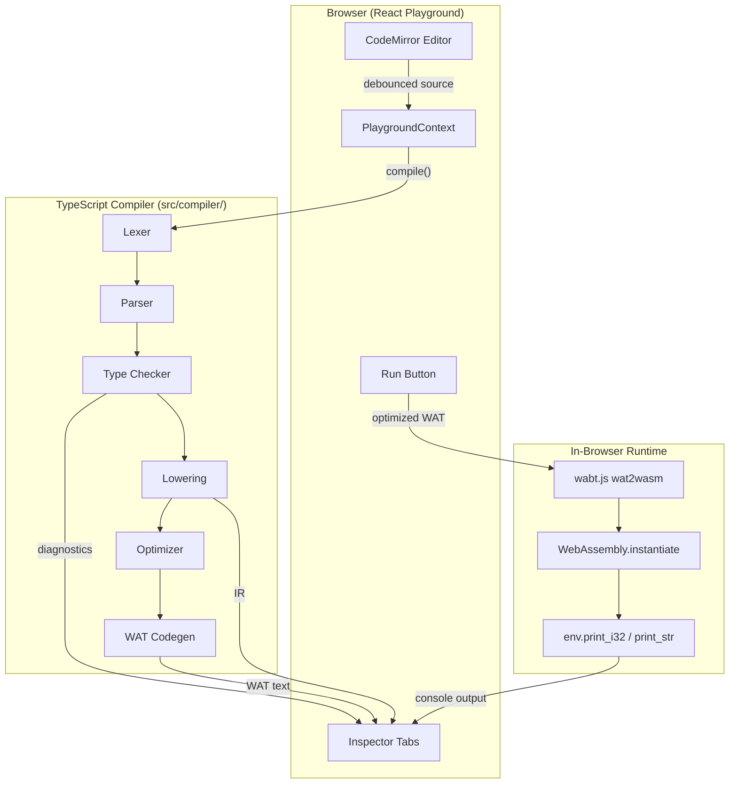

# CustomWASM

**A hand-written, statically typed programming language that compiles to WebAssembly entirely in your browser.** Write source code, watch it flow through every compiler stage—from tokens to optimized IR to WAT—and run the result with zero server dependency.

---

## Table of Contents

- [Project Overview & Purpose](#project-overview--purpose)
- [Deep Dive: Core Features](#deep-dive-core-features)
  - [The CustomWASM Language](#the-customwasm-language)
  - [Compiler Pipeline](#compiler-pipeline)
  - [Interactive Playground](#interactive-playground)
  - [Optimizer](#optimizer)
  - [Memory & Runtime](#memory--runtime)
  - [Stack-Machine Stepper](#stack-machine-stepper)
- [Tech Stack](#tech-stack)
- [Directory & Architecture Layout](#directory--architecture-layout)
- [Getting Started](#getting-started)
- [Environment Configuration](#environment-configuration)
- [Usage & Language Reference](#usage--language-reference)
- [Testing](#testing)
- [Roadmap & Contributing](#roadmap--contributing)

---

## Project Overview & Purpose

### What problem does this solve?

Most developers interact with WebAssembly as an opaque binary format produced by heavyweight toolchains (Rust, C++, AssemblyScript). **CustomWASM inverts that experience**: every stage of compilation is implemented in readable TypeScript, exposed in a live UI, and validated end-to-end with `wabt.js` and `WebAssembly.instantiate`. You can see exactly how source text becomes stack-machine instructions—and why.

### Who is it built for?

| Audience | What they get |
|---|---|
| **Compiler learners** | A complete, interview-defensible pipeline (lexer → parser → type checker → IR → optimizer → codegen) with golden tests at every stage |
| **WebAssembly explorers** | Structured-control-flow lowering, bump-allocator memory layout, and a stepper that animates the WASM value stack |
| **Educators & demo builders** | A zero-backend playground that runs entirely client-side |

### System architecture

The application has two tightly coupled halves that share the same TypeScript compiler code:



Each arrow produces a **serializable artifact** the playground can display. No stage reaches backward or mutates a prior stage's output.

---

## Deep Dive: Core Features

### The CustomWASM Language

CustomWASM is a small, C-like language with static typing and no implicit coercion. The grammar is defined in [`.cursor/memory/architecture.md`](.cursor/memory/architecture.md) and rendered in the playground **Docs** tab.

#### What it does

Provides a familiar imperative syntax—functions, `let`, `if/else`, `while`, arrays, and strings—while mapping cleanly onto WebAssembly's structured control flow and linear memory.

#### How it works under the hood

| Concern | Module |
|---|---|
| Tokenization | [`src/compiler/lexer.ts`](src/compiler/lexer.ts) — hand-written scanner; every token carries a `Span { start, end, line, col }` |
| Parsing | [`src/compiler/parser.ts`](src/compiler/parser.ts) — recursive descent with precedence climbing; produces the AST in [`src/compiler/ast.ts`](src/compiler/ast.ts) |
| Type checking | [`src/compiler/typechecker.ts`](src/compiler/typechecker.ts) — visitor over the AST; produces a typed AST ([`src/compiler/typed-ast.ts`](src/compiler/typed-ast.ts)) |
| Semantic types | [`src/compiler/types.ts`](src/compiler/types.ts) — `i32`, `f64`, `bool`, `string`, `array`, `void` |

**Supported types:**

| Type | WASM representation | Notes |
|---|---|---|
| `i32` | `i32` | Signed 32-bit integers; `%` is i32-only |
| `f64` | `f64` | 64-bit floats; no mixing with `i32` |
| `bool` | `i32` (0 or 1) | Required for `if`/`while` conditions and `&&`/`||` |
| `string` | `i32` pointer | Length-prefixed UTF-8 in linear memory; immutable |
| `T[]` | `i32` pointer | Length-prefixed element array; bounds-checked at runtime |

**Entry point:** every program must define `fn main() -> i32`. The playground exports and calls this function on **Run**.

**Example — arithmetic and precedence:**

```rust
fn main() -> i32 {
  let x = 2 + 3 * 4;
  return x;
}
// Returns 14
```

**Example — recursion:**

```rust
fn fib(n: i32) -> i32 {
  if (n <= 1) { return n; }
  else { return fib(n - 1) + fib(n - 2); }
}
fn main() -> i32 { return fib(10); }
// Returns 55
```

**Example — strings, arrays, and host printing:**

```rust
fn main() -> i32 {
  let s: string = "hello";
  print_str(s);
  let a: i32[] = [10, 20, 30];
  print_i32(a[1]);
  return 0;
}
// Output console: hello, 20
```

> [!NOTE]
> `print_i32` and `print_str` are **host builtins**—void functions imported from the `env` module at runtime. They are not part of the source grammar; the type checker pre-seeds their signatures and codegen emits imports only when used.

---

### Compiler Pipeline

#### What it does

Transforms source text into WebAssembly Text (WAT) through six sequential, inspectable stages. Compilation runs automatically on debounced (~300 ms) source changes; execution happens only when you click **Run**.

#### How it works under the hood

The orchestrator is [`src/compiler/pipeline.ts`](src/compiler/pipeline.ts):

```typescript
export function compile(source: string): CompileResult {
  const tokens = lex(source);
  const { program, diagnostics } = parse(tokens);
  // ... typecheck, lower, optimize, emit ...
  return { tokens, ast, typedAst, diagnostics, ir, wat, optimizedIr, optimizedWat };
}
```

| Stage | Function | Output | Skipped when |
|---|---|---|---|
| **Lex** | `lex()` | `Token[]` with spans | — |
| **Parse** | `parse()` | `Program` AST + diagnostics | Lex errors |
| **Check** | `check()` | Typed AST + diagnostics | Parse errors |
| **Lower** | `lower()` | `IRModule` | Type errors |
| **Opt** | `optimize()` | Optimized `IRModule` | Lower failure |
| **Emit** | `emit()` | WAT string | Lower failure |

The playground **Pipeline Stage Rail** ([`src/playground/components/PipelineStageRail.tsx`](src/playground/components/PipelineStageRail.tsx)) visualizes which stage succeeded or failed, lighting up Lex → Emit in a cascade on each recompile.

**IR design** ([`src/compiler/ir.ts`](src/compiler/ir.ts)): a tree-structured intermediate representation that mirrors WebAssembly's structured control flow exactly—`Block`, `Loop`, `IfStmt`, `Br`, `BrIf`, `Return`—never flat basic blocks or gotos. Lowering ([`src/compiler/lower.ts`](src/compiler/lower.ts)) desugars constructs like `while` into canonical WASM patterns:

```
while (c) body  ⇒  Block L_exit {
                       Loop L_head {
                         BrIf(!c → L_exit)
                         ...body...
                         Br(L_head)
                       }
                     }
```

Short-circuit `&&` / `||` lower to `IfExpr` nodes that map 1:1 onto WASM `if (result T) ... else ... end`.

**Codegen** ([`src/compiler/codegen.ts`](src/compiler/codegen.ts), [`src/compiler/watOps.ts`](src/compiler/watOps.ts)): walks the IR post-order onto a shared `WatOp[]` instruction stream, then pretty-prints to WAT text. The same stream is consumed by the stepper.

---

### Interactive Playground

#### What it does

A split-pane React app: source editor on the left, tabbed inspector on the right. Every compiler artifact updates live as you type.

#### How it works under the hood

| Component | File | Responsibility |
|---|---|---|
| App shell | [`src/playground/App.tsx`](src/playground/App.tsx) | Layout, header, Run button, intro skip |
| State | [`src/playground/context/PlaygroundContext.tsx`](src/playground/context/PlaygroundContext.tsx) | Source, debounced compile, wabt handle, run output |
| Editor | [`src/playground/components/Editor.tsx`](src/playground/components/Editor.tsx) | CodeMirror 6 with diagnostic squiggle underlines |
| Inspector | [`src/playground/components/Inspector.tsx`](src/playground/components/Inspector.tsx) | Tabbed views for all artifacts |
| AST tree | [`src/playground/components/AstTab.tsx`](src/playground/components/AstTab.tsx) + [`src/playground/lib/astToTree.ts`](src/playground/lib/astToTree.ts) | Collapsible typed/untyped AST |
| IR tree | [`src/playground/components/IrTab.tsx`](src/playground/components/IrTab.tsx) + [`src/playground/lib/irToTree.ts`](src/playground/lib/irToTree.ts) | Unoptimized IR visualization |
| WAT | [`src/playground/components/WatTab.tsx`](src/playground/components/WatTab.tsx) | Generated WebAssembly Text |
| Output | [`src/playground/components/OutputTab.tsx`](src/playground/components/OutputTab.tsx) | Runtime prints + `main()` return value |
| Docs | [`src/playground/components/DocsTab.tsx`](src/playground/components/DocsTab.tsx) | Generated grammar + memory diagram |
| Run | [`src/playground/lib/runWasm.ts`](src/playground/lib/runWasm.ts) | `parseWat → validate → toBinary → instantiate → main()` |

**First-visit intro:** on your first visit, an autoplay sequence ([`src/playground/hooks/useAutoplayIntro.ts`](src/playground/hooks/useAutoplayIntro.ts)) types the `fib(10)` showcase program character-by-character, tours the inspector tabs, and runs the result. Click **Skip intro** or focus the editor to interrupt. Completion is stored in `localStorage` under `customwasm.introSeen`.

**Hard boundary:** `src/compiler/**` never imports from `src/playground/**` or references browser globals—the same compiler runs in Vitest (Node) and the browser.

---

### Optimizer

#### What it does

Reduces IR instruction count through constant folding and dead code elimination, while preserving runtime semantics—including trap behavior for division by zero.

#### How it works under the hood

[`src/compiler/optimizer/index.ts`](src/compiler/optimizer/index.ts) runs a configurable pass pipeline to **fixpoint** (default budget: 20 iterations):

| Pass | File | Transforms |
|---|---|---|
| **Constant folding** | [`src/compiler/optimizer/constantFold.ts`](src/compiler/optimizer/constantFold.ts) | Evaluates `BinOp(Const, Const)` with exact WASM semantics; collapses constant `IfExpr`; **never** folds `x / 0`, `x % 0`, or `INT_MIN / -1` |
| **Dead code elimination** | [`src/compiler/optimizer/dce.ts`](src/compiler/optimizer/dce.ts) | Truncates after `Return`/`Br`; prunes constant `IfStmt` arms; removes unread locals and re-densifies indices |

The **Optimized IR** tab ([`src/playground/components/OptimizedIrTab.tsx`](src/playground/components/OptimizedIrTab.tsx)) shows unoptimized vs. optimized IR side-by-side with instruction counts and percentage reduction via `countInstructions()`.

`compile()` keeps both artifacts: `ir`/`wat` (unoptimized) and `optimizedIr`/`optimizedWat` (optimized). The playground **Run** button executes the unoptimized WAT; tests verify optimized modules produce identical runtime behavior.

---

### Memory & Runtime

#### What it does

Strings and arrays live in WebAssembly linear memory using a bump allocator. Indexing is bounds-checked; out-of-bounds access traps with `unreachable`.

#### How it works under the hood

Lowering and codegen implement the layout defined in [architecture.md §7](.cursor/memory/architecture.md):

```
0x0000 ─ 0x03FF   Reserved / scratch (address 0 = null marker)
0x0400 ─ ...      Static data: string literals (compile-time)
heapBase          First byte after static data (8-byte aligned)
$hp (global)      Mutable heap pointer; bump allocator advances this
```

**Object layouts:**

```
string:   [ length: i32 ][ bytes: u8 × length ]     // UTF-8, no terminator
array<T>: [ length: i32 ][ elements: T × length ]   // i32 stride 4, f64 stride 8
```

- String literals are interned and placed in static data segments ([`src/compiler/lower.ts`](src/compiler/lower.ts)).
- Array literals and dynamic allocations call `$alloc(nBytes)` at runtime.
- Bounds checks emit `(u32)i >= length ? unreachable : load/store`.

**Runtime execution** ([`src/playground/lib/runWasm.ts`](src/playground/lib/runWasm.ts)):

1. `wabt.parseWat("playground.wat", wat)`
2. `module.validate()` — stack depth, local indices, branch targets
3. `module.toBinary({})` → `Uint8Array`
4. `WebAssembly.instantiate(bytes, imports)` with [`makePrintImports()`](src/compiler/hostImports.ts)
5. Call exported `main()` and capture return value + print output

Each **Run** creates a fresh WASM instance, so bump-allocator leaks are bounded to a single execution.

The **Docs** tab includes an SVG memory-layout diagram ([`src/playground/components/MemoryLayoutDiagram.tsx`](src/playground/components/MemoryLayoutDiagram.tsx)).

---

### Stack-Machine Stepper

#### What it does

Animates WASM execution instruction-by-instruction, showing the value stack and locals after every op—without changing compiler output or program semantics.

#### How it works under the hood

[`src/compiler/stepper.ts`](src/compiler/stepper.ts) interprets the same `WatOp[]` stream that codegen formats to WAT. `trace(ir)` records `Step` snapshots: instruction text, stack contents, local values, and function name.

The **Stepper** tab ([`src/playground/components/StepperTab.tsx`](src/playground/components/StepperTab.tsx)) provides Reset, Step, Play/Pause, and adjustable speed controls. Final stepped results are regression-checked against real `wabt.js` execution in tests.

---

## Tech Stack

| Category | Technology | Version | Why |
|---|---|---|---|
| **Language** | TypeScript | 5.7+ | Strict mode, discriminated unions for AST/IR exhaustiveness |
| **Frontend** | React | 19 | Playground UI with context-based state |
| **Build** | Vite | 6 | Fast dev server and production bundling |
| **Styling** | Tailwind CSS | 4 | Utility-first styling; no component library |
| **Editor** | CodeMirror 6 | 6.x | Source editing with diagnostic decorations |
| **WASM encoding** | wabt.js | 1.0.36 | `wat2wasm` validation and binary generation (browser + tests) |
| **Execution** | WebAssembly API | — | `WebAssembly.instantiate` in the browser |
| **Testing** | Vitest | 3.x | Compiler unit tests, golden IR tests, runtime e2e tests |
| **Testing (DOM)** | Testing Library | 16.x | Playground component tests with jsdom |
| **Fonts** | IBM Plex Sans/Mono | — | UI typography (loaded from Google Fonts) |

> [!IMPORTANT]
> The compiler has **zero runtime npm dependencies**. React, CodeMirror, and wabt are used only by the playground and test harness.

---

## Directory & Architecture Layout

```
CustomWASM/
├── index.html                          # Vite entry HTML; loads playground/main.tsx
├── package.json                        # Scripts: dev, build, test, typecheck, docs:generate
├── vite.config.ts                      # Vite + React + Tailwind plugins
├── vitest.config.ts                    # Vitest with jsdom + test setup
├── tsconfig.json                       # strict TS, ES2022, noEmit
│
├── scripts/
│   └── generate-lang-ref.mjs           # Extracts EBNF from architecture.md → generated docs
│
├── src/
│   ├── compiler/                       # Pure TypeScript — NO React/DOM imports
│   │   ├── lexer.ts                    # Source → Token[]
│   │   ├── parser.ts                   # Token[] → Program AST
│   │   ├── ast.ts                      # Untyped AST node types
│   │   ├── typechecker.ts              # AST → TypedProgram + diagnostics
│   │   ├── typed-ast.ts                # Typed AST (every Expr has resolved Type)
│   │   ├── types.ts                    # Semantic Type union
│   │   ├── lower.ts                    # Typed AST → IRModule
│   │   ├── ir.ts                       # IR node types (structured control flow)
│   │   ├── optimizer/
│   │   │   ├── index.ts                # optimize(), countInstructions()
│   │   │   ├── constantFold.ts         # Constant folding pass
│   │   │   ├── dce.ts                  # Dead code elimination pass
│   │   │   └── fixpoint.ts             # Fixpoint iteration with budget
│   │   ├── codegen.ts                  # IRModule → WAT text (via watOps)
│   │   ├── watOps.ts                   # Shared WatOp[] compile + format + stepper input
│   │   ├── stepper.ts                  # Stack-machine trace interpreter
│   │   ├── hostImports.ts              # env.print_i32 / print_str for runtime
│   │   ├── pipeline.ts                 # compile() orchestrator
│   │   ├── diagnostics.ts              # Diagnostic { message, span, severity }
│   │   ├── token.ts                    # Token types and Span
│   │   └── __tests__/                  # 190+ tests: lexer, parser, typecheck, IR, optimizer, runtime
│   │
│   └── playground/                     # React app
│       ├── main.tsx                    # ReactDOM.createRoot + PlaygroundProvider
│       ├── App.tsx                     # Split-pane layout
│       ├── index.css                   # Tailwind + custom design tokens
│       ├── context/
│       │   └── PlaygroundContext.tsx   # Source, compile result, wabt, run
│       ├── hooks/
│       │   ├── useDebouncedValue.ts    # 300 ms debounce for compile
│       │   ├── useWabt.ts              # Async wabt.js initialization
│       │   └── useAutoplayIntro.ts     # First-visit guided tour
│       ├── components/
│       │   ├── Editor.tsx              # CodeMirror source editor
│       │   ├── Inspector.tsx           # Tabbed artifact panel
│       │   ├── PipelineStageRail.tsx   # Lex → Emit stage indicator
│       │   ├── AstTab.tsx / IrTab.tsx / OptimizedIrTab.tsx / WatTab.tsx
│       │   ├── StepperTab.tsx          # Stack animation
│       │   ├── OutputTab.tsx           # Runtime console
│       │   ├── DocsTab.tsx             # Language reference + memory diagram
│       │   ├── DiagnosticsList.tsx     # Error/warning list
│       │   ├── TreeView.tsx            # Collapsible tree (AST + IR)
│       │   ├── RunButton.tsx           # Execute WASM
│       │   └── MemoryLayoutDiagram.tsx # SVG heap map
│       ├── lib/
│       │   ├── runWasm.ts              # WAT → instantiate → main()
│       │   ├── pipelineStages.ts       # Stage success/failure derivation
│       │   ├── astToTree.ts / irToTree.ts
│       │   ├── diagnosticDecorations.ts
│       │   └── introSource.ts          # fib(10) showcase program
│       ├── docs/
│       │   └── language-reference.generated.md  # Auto-generated from EBNF
│       └── __tests__/                  # Playground component + integration tests
│
└── .cursor/
    ├── memory/
    │   ├── architecture.md             # Grammar, AST, IR, memory layout (source of truth)
    │   ├── projectbrief.md             # Phase roadmap and success metrics
    │   └── techContext.md              # Stack decisions and module boundaries
    └── rules/                          # Agent rules for lexer, typechecker, codegen phases
```

---

## Getting Started

### Prerequisites

| Tool | Minimum version | Verify |
|---|---|---|
| **Node.js** | 18+ (tested on 25.x) | `node -v` |
| **npm** | 9+ | `npm -v` |

No Docker, database, or external services are required.

### Installation & Execution

```bash
# 1. Clone the repository
git clone https://github.com/your-org/CustomWASM.git
cd CustomWASM

# 2. Install dependencies
npm install

# 3. Type-check the project
npm run typecheck

# 4. Run the test suite (190 tests)
npm test

# 5. Start the development server
npm run dev
```

Open the URL Vite prints (typically `http://localhost:5173`) in your browser.

### Production build

```bash
npm run build    # tsc --noEmit && vite build → dist/
npm run preview  # Serve the production build locally
```

### Regenerate language reference

The **Docs** tab reads a generated markdown file. After editing the EBNF in `.cursor/memory/architecture.md`:

```bash
npm run docs:generate
```

---

## Environment Configuration

This project runs entirely client-side and **does not use environment variables**. There is no `.env` file, no API keys, and no backend configuration.

| Variable | Required | Purpose | Example |
|---|---|---|---|
| — | — | No environment variables are used | — |

**Browser storage (optional, client-only):**

| Key | Storage | Purpose |
|---|---|---|
| `customwasm.introSeen` | `localStorage` | Set to `"1"` after the first-visit autoplay intro completes; prevents replay |

---

## Usage & Language Reference

### Playground workflow

1. **Type or paste** CustomWASM source in the left editor pane.
2. **Watch** the pipeline rail light up Lex → Emit as compilation proceeds.
3. **Inspect** intermediate artifacts in the right tabs:
   - **AST** — parse tree with spans
   - **IR** — lowered intermediate representation
   - **Optimized IR** — side-by-side diff with instruction counts
   - **WAT** — generated WebAssembly Text
   - **Stepper** — instruction-by-instruction stack animation
   - **Output** — runtime results (after Run)
   - **Docs** — full grammar reference and memory layout
4. **Click Run** to validate WAT through `wabt.js`, instantiate WASM, and call `main()`.
5. **Read diagnostics** inline (editor squiggles) and in the inspector header when errors occur.

### Language quick reference

**Types:** `i32`, `f64`, `bool`, `string`, `T[]`

**Statements:** `let`, assignment, `if`/`else`, `while`, `return`, expression statements, blocks

**Operators (precedence low → high):** `||`, `&&`, `==`/`!=`, `<`/`<=`/`>`/`>=`, `+`/`-`, `*`/`/`/`%`, unary `!`/`-`, call, index

**Comments:** `//` line comments; whitespace is ignored

**Functions:**

```rust
fn add(a: i32, b: i32) -> i32 {
  return a + b;
}
fn main() -> i32 { return add(3, 4); }
```

**Control flow:**

```rust
fn abs(x: i32) -> i32 {
  if (x < 0) { return -x; }
  else { return x; }
}

fn sum_to_n(n: i32) -> i32 {
  let acc: i32 = 0;
  let i: i32 = 0;
  while (i <= n) {
    acc = acc + i;
    i = i + 1;
  }
  return acc;
}
```

**Arrays:**

```rust
fn main() -> i32 {
  let nums: i32[] = [1, 2, 3];
  nums[1] = 99;
  return nums[0] + nums[1] + nums[2];  // 103
}
```

### Host builtins (runtime imports)

These are callable from source but implemented by the host environment, not compiled to WASM:

| Builtin | Signature | Behavior |
|---|---|---|
| `print_i32(value: i32)` | void | Appends `value` to the Output console |
| `print_str(s: string)` | void | Reads length-prefixed UTF-8 from linear memory; appends to Output |

Implementation: [`src/compiler/hostImports.ts`](src/compiler/hostImports.ts)

### Compiler API (programmatic)

Import the pipeline directly—the same module used by the playground and tests:

```typescript
import { compile } from "./src/compiler/pipeline.js";

const result = compile(`
  fn main() -> i32 { return 2 + 3 * 4; }
`);

console.log(result.wat);           // Generated WAT text
console.log(result.diagnostics);   // [] if clean
console.log(result.optimizedWat);  // After constant fold + DCE
```

### Validation gate

Every test that produces WAT runs it through `wabt.js`:

```
parseWat → module.validate() → toBinary() → WebAssembly.instantiate() → assert main() result
```

This verifies stack depth, local indices, branch target validity, and type correctness—not just syntax.

---

## Testing

```bash
npm test          # Run all 190 tests once
npm run test:watch  # Watch mode
npm run typecheck   # TypeScript strict check without emit
```

Test categories:

| Directory | Coverage |
|---|---|
| `src/compiler/__tests__/lexer.test.ts` | Token streams with exact spans |
| `src/compiler/__tests__/parser.test.ts` | AST shapes + error recovery |
| `src/compiler/__tests__/typechecker.test.ts` | Static typing rules + diagnostics |
| `src/compiler/__tests__/lower.test.ts` | AST → IR golden tests |
| `src/compiler/__tests__/optimizer-*.test.ts` | Fold, DCE, fixpoint, trap preservation, equivalence |
| `src/compiler/__tests__/codegen*.test.ts` | WAT output + runtime results |
| `src/playground/__tests__/` | UI components, pipeline rail, runWasm integration |

---

## Roadmap & Contributing

### Completed phases

| Phase | Deliverable |
|---|---|
| **1** | Lexer, parser, basic WAT codegen (`2 + 3 * 4 → 14`) |
| **2** | React playground with live AST + Run |
| **3** | Control flow, functions, scoping, WASM structured CF |
| **4** | Static type checker with collected diagnostics |
| **5** | Tree-structured IR + lowering; codegen retargeted to IR |
| **6** | Optimizer (constant fold + DCE) with fixpoint iteration |
| **7** | `string`/`array` types, bump allocator, host print builtins |
| **8 (partial)** | Diagnostic squiggles, generated docs, memory diagram, stepper, autoplay intro |

### Future improvements (Phase 8 stretch)

- Free-list allocator upgrade (replacing bump-only)
- `for` loops and `else if` chains as syntactic sugar
- Source-map-style WAT ↔ source highlighting
- Additional optimizer passes (copy propagation, strength reduction)
- Explicit cast builtin between numeric types

### Contributing

1. **Read the contracts first:** [`.cursor/memory/architecture.md`](.cursor/memory/architecture.md) defines the grammar, AST, IR, and memory layout. Changes to interfaces must update that file in the same PR.
2. **Respect the module boundary:** `src/compiler/**` must never import from `src/playground/**`.
3. **Add tests:** Every feature needs `(input source → expected output)` tests. Generated WAT must pass `wat2wasm` validation.
4. **Run the gates before submitting:**
   ```bash
   npm run typecheck && npm test
   ```
5. **Explain your algorithm:** PR descriptions should explain the core algorithm in 3–8 sentences (e.g., "precedence climbing: each level parses operators of one precedence and recurses tighter") so the design is interview-defensible.

---

<p align="center">
  <strong>CustomWASM</strong> — see every byte from source to stack.
</p>
